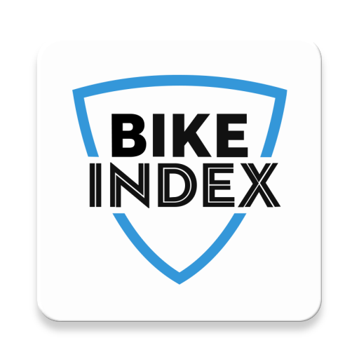

<h1 align="center" style="text-align: center; padding-bottom: 20px;">
   
  
   
  Bike Index
   
</h1>

<h4 align="center">View all bikes around the world, filter them and find any bike.  If the bike is stolen, you can contact the owner and save the bike.</h4>

  
  
  
  

  <a href="#about">About</a> •
  <a href="#feedback">Feedback</a> •
  <a href="#build-process">Build process</a> •
  <a href="#technology-stack">Technology stack</a> •
  <a href="#license">License</a>

