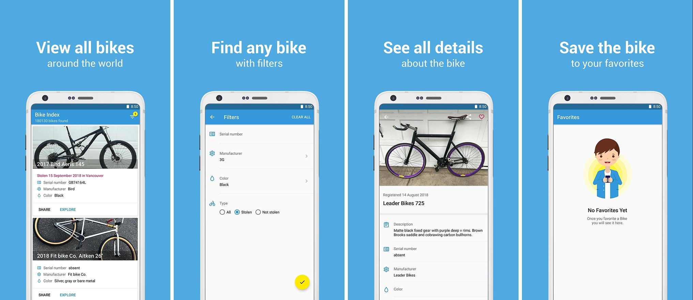

<h1 align="center" style="text-align: center; padding-bottom: 20px;">
   
  
   
  Bike Index
   
</h1>

<h4 align="center">View all bikes around the world, filter them and find any bike.  If the bike is stolen, you can contact the owner and save the bike.</h4>

  
  
  
  

  <a href="#features">Features</a> •
  <a href="#technology-stack">Technology stack</a> •
  <a href="#build-process">Build process</a> •
  <a href="#contribute">Contribute</a> •
  <a href="#license">License</a>

  

## Features

A few of the things you can do with Bike Index:

* View all bikes around the world
* Find any bike with filters by serial number, manufacturer, color and type.
* See all details about the bike
* Share the bike
* Add bike to your favorites
* Contact the owner if bike is stolen

## Technology stack

Technology stack used in Bike Index

* [Clean architecture](https://fernandocejas.com/2014/09/03/architecting-android-the-clean-way/)
* [MVVM](https://developer.android.com/topic/libraries/architecture/viewmodel)
* [Coroutines](https://kotlinlang.org/docs/reference/coroutines.html)
* [Navigation Architecture Component](https://developer.android.com/topic/libraries/architecture/navigation/)
* [Room Persistence Library](https://developer.android.com/training/data-storage/room/)
* [Dagger](https://google.github.io/dagger/)
* [Retrofit](https://square.github.io/retrofit/)
* [Glide](https://github.com/bumptech/glide)
* [LeakCanary](https://github.com/square/leakcanary)

## Build Process

**Android Studio 3.2 required**

* Clone or download the repo
* Import project and build

## Contribute

If you notice any bugs in the app, see some code that can be improved, or have features you would like to be added, please [file an issue](https://github.com/vladsonkin/bikeindex/issues/new).

If you want to open a PR that fixes a bug or adds a feature, then I can't thank you enough! It is definitely appreciated if an issue has been created before-hand so it can be discussed first.

## Licence

Licensed under the Apache License, Version 2.0 (the "License");
You may not use this file except in compliance with the License.
You may obtain a copy of the License at

http://www.apache.org/licenses/LICENSE-2.0

Unless required by applicable law or agreed to in writing, software
distributed under the License is distributed on an "AS IS" BASIS,
WITHOUT WARRANTIES OR CONDITIONS OF ANY KIND, either express or implied.
See the License for the specific language governing permissions and
limitations under the License.